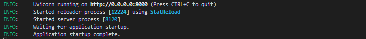
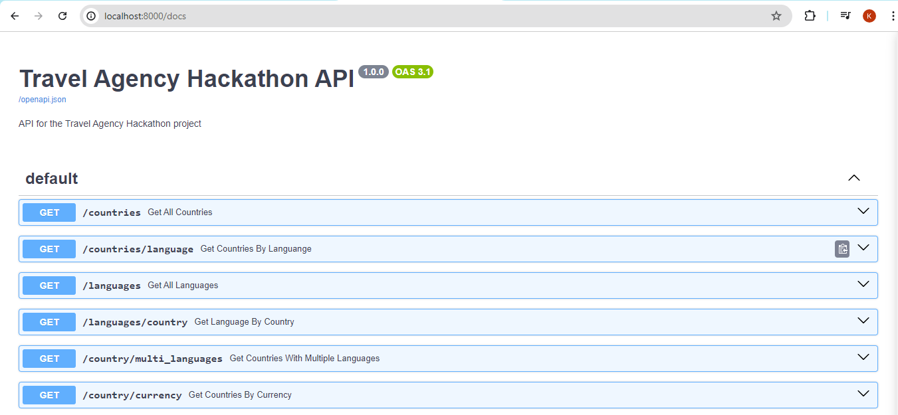

# travel-agency-hackathon

## Table of Contents
- Overview
- Architecture
- [Project Structure]
- Prerequisites
- Setup Instructions
    - Setting up GCS Bucket
    - Creating a Service Account
    - Inserting your Configurations 
    - Creating the Cloud Function
    - Setting up BigQuery
- Transformation Logic
- Testing the Pipeline
- Testing the API Endpoint 
- Monitoring and Logging
- Contributing
- License


## Overview
This project is a submission by team-3(Data Natives) for the DEC countries_information_ingestion hackathon where data is extracted from a REST API to a data lake, transformed and loaded into a data warehouse.


## Architecture


## Project Structure

- `utils`:
- `config.py`:
- `delpoy.sh`:
- `raw_data_loader.py`:
- `main.py`:
- `constants.sh`:
- `api`:
- `requirements.txt`:
- `Travel_Agency.ipynb`:  
  
```BASH
travel-agency-hackathon
│   constants.sh
│   deploy.sh
│   main.py
│   raw_data_loader.py
│   README.md
│   requirements.txt
│   
├───api
│   │   main.py
│   │   
│   ├───data
│   │   │   countries_data.py
│   │   │   data.csv
│   │           
│   ├───dependencies
│   │   │   countries.py
│   │           
│   ├───routers
│   │   │   api_routes.py
│           
├───screenshots
│       api_server_startup.PNG
│       swagger_ui.PNG
│       
├───utils
│   │   api_manager.py
│   │   bq_manager.py
│   │   config.py
│   │   data_extractor.py
│   │   gcs_manager.py
│   │   __init__.py
```


## Prerequisites
- Google Cloud Platform account
- Google Cloud SDK installed
- Python 3.10 or above installed

## Setup Instructions


### Setting up GCS Bucket

### Creating a Service Account


### Inserting your Configurations


### Setting up BigQuery


## Transformation Logic


## Testing the Pipeline

## Testing the API Endpoint  
A FastAPI implementation was included to perform inference on the loaded dataset to help answer the questions raised in the task's description.    
  
To start the API application, simply run the command below from the project parent directory.  
  
```BASH
python api/main.py
```  
  
This starts the application on port 8000, as shown in the screenshot below.  

  
  
To access the endpoints from the browser, open the page `http://localhost:8000/docs` for the Swagger UI. This opens up a page similar to the image below.  
  
  
  
You can test all the endpoints from the Swagger UI.

## Contributing

## License 
