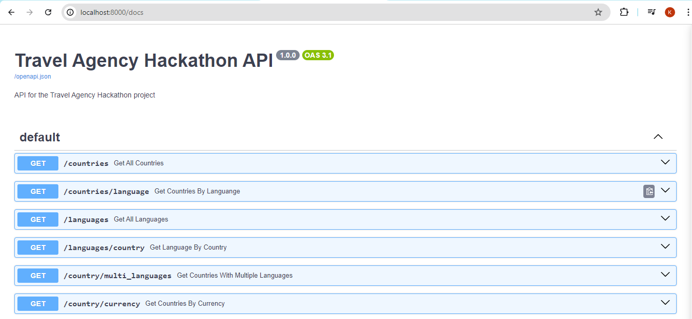
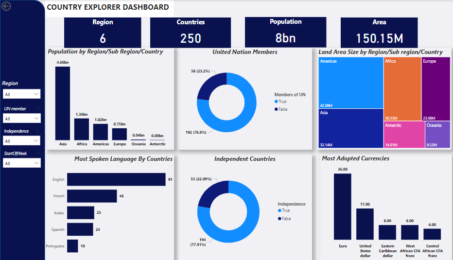

# travel-agency-hackathon

## Table of Contents

- [Overview](#overview)
- [Architecture](#architecture)
- [Project Structure](#project-structure)
- [Prerequisites](#prerequisites)
- [Setup Instructions](#setup-instructions)
    - [Setting up GCS Bucket](#setting-up-gcs-bucket)
    - [Creating a Service Account](#creating-a-service-account)
    - [Inserting your Configurations](#inserting-your-configurations)
    - [Setting up BigQuery](#setting-up-bigquery)
- [Testing the Pipeline](#testing-the-pipeline)
- [Testing the API Endpoint](#testing-the-api-endpoint)
- [Analysis](#analysis)
- [Visualization](#visualization)
- [Insights](#insights)
- [Contributing](#contributing)
- [License](#license)


## Overview
This project is a submission by team-3(Data Natives) for the DEC countries_information_ingestion hackathon where data is extracted from a REST API to a data lake, transformed and loaded into a data warehouse.


## Architecture
We adpoted to use an ETL pipeline using majorly Google Cloud Platform services. The architecture involves extracting data from a REST API, storing raw data in a Google Cloud Storage (GCS) bucket, applying the transformation using a Cloud Function, and loading the transformed data into a BigQuery table within the same function.


## Project Structure

- `utils`: This folder contains various scripts used to interact with API, Cloud Storage and BigQuery to extract, transform and load data.
- `delpoy.sh`: This bash script deploys an event cloud function.
- `images`: This folder contains images used in the README.md file.
- `raw_data_loader.py`: This script extracts data from an API and writes the data into a gcs bucket. It creates one if needed.
- `main.py`: This script contains a cloud function. It is an event based function that gets triggered when an object is written to the attached cloud storage bucket. The function applies transformation logic and loads the data into the bigquery data warehouse. 
- `constants.sh`: This is a configuration script where environment variables can be set.
- `api`: This folder contains a FastAPI implementation 
- `requirements.txt`: This text file contains all required dependencies
- `Travel_Agency.ipynb`: This notebook contains analysis answers to the questions asked in the task's description


## Prerequisites
- Google Cloud Platform account
- Google Cloud SDK installed
- Python 3.10 or above installed

## Getting Started
Clone the repository to your preferred destination
```bash
git clone https://github.com/bazuayelewis/travel-agency-hackathon.git
```

Install the required dependencies
```bash
pip install -r requirements.txt
```

### **Setup Instructions**
### Setting up GCS Bucket
1. Go to [Google Cloud Console](https://console.cloud.google.com/storage/)
2. Create a bucket and set the region

### Creating a Service Account
1. Go to [Google Cloud Service Account](https://console.cloud.google.com/iam-admin/serviceaccounts)
2. Select the Project you are working with
3. Create a service account
4. Grant the following roles to the service account(Storage Admin, Cloud Functions Developer, Bigquery Data Editor, Bigquery Data Viewer, Pub/Sub Admin and Eventarc Admin)
5. (Optional) Add a new key and download as a json file

### Setting up BigQuery
1. Go to [Google Cloud BigQuery](https://console.cloud.google.com/bigquery)
2. Select on your Project
3. Create a dataset (Must be in the same region as your bucket)
4. Create an empty table. 
5. Copy the table_ID


### Inserting your Configurations
Update the [`constants.sh`](/constants.sh) script with your configurations.
```bash
#REQUIRED
export TABLE_ID="<your-bigquery-table-id>" 
```

### **Testing the Pipeline**
To test the pipeline, run the following commands;
```bash
#To configure gcloud using service account keys
export GOOGLE_APPLICATION_CREDENTIALS="<your-service-account-key-path>"
```

Once authenticated, run the deploy script.
```bash
#Make the bash scripts executable
chmod +x constants.sh deploy.sh
./deploy.sh
```

After the function  has been created successfully.
```bash
#export the constants to your local envrionment
source ./constants.sh

#Run the data loading script
python raw_data_loader.py
```

## Testing the API Endpoint  
A FastAPI implementation was included to perform inference on the loaded dataset to help answer the questions raised in the task's description.    
  
To start the API application, simply run the command below from the project parent directory.  
  
```BASH
python api/main.py
```  
  
This starts the application on port 8000, as shown in the screenshot below.  

  
  
To access the endpoints from the browser, open the page `http://localhost:8000/docs` for the Swagger UI. This opens up a page similar to the image below.  
  
  
  
You can test all the endpoints from the Swagger UI.

## Analysis
All questions asked in the case study description were answered in [here](/Travel_Agency.ipynb)

## Visualization


## Insights
- **70%** of countries whose week starts from Sunday are located in the Asian region
- Taiwan is the most populated country that is not a United Nation member nor an independent country
- Zimbabwe is the most multilingual country as they speak **10** languages
- Euro is the most used currency across all countries

## Contributing
Contributions are welcome! Please fork the repository and create a pull request with your changes. Any of the collaborators would review and approve if neccessary.

## License 
This project is licensed under the MIT License 
